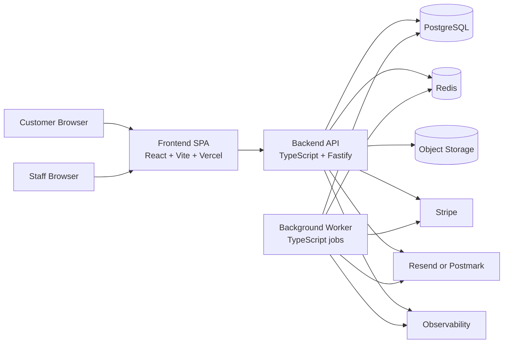

# Maison Arc Application Architecture

## Purpose

This document defines the full application architecture for Maison Arc as it evolves
from a frontend-only storefront prototype into a production system for bespoke,
made-to-order footwear commissions.

The architecture is intentionally designed for the actual product shape already
visible in the repo:

- Editorial storefront and journal
- Product collection and product detail pages
- Bespoke configurator and saved designs
- Shared design previews
- Cart, checkout, and order confirmation
- Account area
- Atelier review and production workflow

## Architectural Position

Maison Arc should start as a **modular monolith** with clear domain boundaries,
not as microservices.

Why:

- The business domain is cohesive.
- The product is still early stage.
- There is no existing backend to decompose.
- Operational simplicity matters more than theoretical service isolation.
- Strong module boundaries can be preserved now and extracted later if scale
  proves it necessary.

## High-Level System



## Frontend / Backend Boundary

### Frontend Responsibilities

- Routing and presentation
- Anonymous browsing of collection, journal, atelier, and about pages
- Authenticated account, saved designs, cart, checkout, and shared design views
- Local optimistic UX state
- No direct database access
- No business-critical security logic

### Backend Responsibilities

- Authentication and session management
- Catalog, pricing, and configuration validation
- Saved design persistence
- Cart persistence
- Checkout orchestration
- Payment method setup and charging
- Order and atelier workflow state
- Share link generation and validation
- Audit logging
- Rate limiting and abuse protection

## Backend Module Architecture

The backend should be one deployable service with strict internal modules.

```text
backend/
  src/
    app/
      server.ts
      config.ts
    modules/
      auth/
      users/
      catalog/
      pricing/
      designs/
      shared-designs/
      cart/
      checkout/
      orders/
      atelier/
      journal/
      payments/
      notifications/
      admin/
      audit/
    platform/
      db/
      cache/
      queue/
      storage/
      email/
      observability/
      security/
```

### Core Modules

- `auth`: customer sign-in, session issuance, magic links, staff auth, device/session revocation
- `users`: user profile, addresses, preferences, sizing profile
- `catalog`: products, availability, configuration compatibility
- `pricing`: price rules, surcharges, deposit calculation
- `designs`: saved commission drafts and snapshots
- `shared-designs`: public share links for design previews
- `cart`: persistent customer cart
- `checkout`: checkout session creation, validation, payment method setup
- `orders`: order placement, order items, order state machine
- `atelier`: internal review queue, approval/rejection, production updates
- `journal`: editorial content read APIs and CMS hooks
- `payments`: Stripe integration, payment method vaulting, capture/refund flows
- `notifications`: email and operational notifications
- `admin`: staff-only management endpoints
- `audit`: append-only event and change tracking

## Runtime Architecture

### API Service

Recommended stack:

- Node.js 22 LTS
- TypeScript
- Fastify
- Zod for request/response validation
- Prisma ORM or Drizzle ORM

Why Fastify:

- Good performance with low framework overhead
- Strong TypeScript support
- Clean plugin/module model
- Simpler than NestJS for this application size

### Worker Service

Separate process, same codebase.

Handles:

- Email sending
- share-link cleanup
- payment retries
- post-checkout workflows
- atelier SLA reminders
- journal cache invalidation fanout

### Queue

Use Redis-backed jobs.

Recommended:

- BullMQ

## Domain State Model

### Customer Journey

1. Browse catalog and content anonymously
2. Save or copy a design
3. Authenticate before persistent save / checkout
4. Add designs to cart
5. Submit checkout with customer details
6. Save payment method, do not capture immediately
7. Create order in `submitted` state
8. Atelier reviews materials, sizing, and lead time
9. If approved, convert estimated deposit into actual payable request
10. Capture deposit and move order to production

### Key Business Rule

The frontend currently presents an estimated deposit at checkout, but product notes
also state no payment is captured until atelier review.

The backend should enforce this model:

- Checkout stores the payment method and estimated deposit.
- Order enters `submitted` state with `estimated_deposit_amount`.
- Atelier review either approves or rejects.
- Only after approval is a payable charge created and captured.

This avoids depending on fragile long-lived card authorization windows.

## Database Strategy

Primary database: PostgreSQL

Why:

- Strong relational model for customers, designs, carts, orders, payments
- Good transactional integrity
- Native JSONB for configurable design snapshots
- Strong indexing and full-text options
- Mature managed-hosting ecosystem

See [database-schema.sql](C:/Users/dotmactech/Maison/docs/architecture/database-schema.sql).

## Authentication Strategy

### Customer Authentication

Primary strategy:

- Email magic link
- Optional one-time code fallback

Future-compatible:

- Add WebAuthn/passkeys later for repeat luxury clients

Session model:

- Server-side session with opaque session ID
- Session ID in secure, httpOnly, sameSite=lax cookie
- Session data stored in Redis, source of truth also persisted in Postgres

Why not JWT-only auth:

- Harder revocation
- Harder incident response
- Unnecessary complexity for a web-first product

### Staff Authentication

Separate staff auth path:

- SSO if Maison Arc uses Google Workspace / Microsoft Entra
- Otherwise email + password + TOTP MFA

Rules:

- Staff users isolated by role
- No customer/staff role mixing by default
- Elevated actions require audit log entries

### Authorization Model

Role-based plus ownership checks.

Customer roles:

- `customer`

Staff roles:

- `atelier_reviewer`
- `customer_concierge`
- `content_editor`
- `admin`

Ownership checks:

- Customers may access only their own designs, carts, orders, addresses, and sessions
- Shared design links expose only a public-safe projection

## Caching Strategy

### CDN / Edge Cache

Cache at edge:

- SPA assets
- product images
- journal hero media
- other static assets

Headers:

- hashed assets: `cache-control: public, max-age=31536000, immutable`

### Redis Cache

Use Redis for:

- session store
- rate limiting
- catalog response cache
- journal response cache
- configuration options cache
- share token lookup acceleration
- background queue

### API Cache Rules

Cacheable:

- `GET /catalog/products`
- `GET /catalog/products/:slug`
- `GET /journal/articles`
- `GET /journal/articles/:slug`
- public shared design projection

Do not cache:

- account
- designs
- cart
- checkout
- orders
- atelier actions

### Invalidation

- Product update invalidates catalog caches
- Journal publish invalidates journal caches
- Shared design revoke invalidates share cache
- Order state change invalidates order and cart summaries

## Deployment Strategy

### Recommended Initial Production Topology

Frontend:

- Vercel

Backend API:

- Railway or Fly.io initially, Docker-based deployment

Worker:

- Same platform as API, separate process

Database:

- Neon Postgres or managed Postgres on Railway

Redis:

- Upstash Redis or managed Redis on Railway

Object storage:

- Cloudflare R2 or AWS S3

Email:

- Resend or Postmark

Payments:

- Stripe

### Environment Layout

- `local`
- `preview`
- `staging`
- `production`

Rules:

- Separate DB and Redis per environment
- Preview environments may share object storage bucket prefix but not primary DB
- Production secrets only in managed secret stores

### Deployment Flow

1. Frontend pull request creates preview deployment
2. Backend pull request creates preview API deployment
3. Migrations run in preview automatically
4. Staging deploy runs smoke tests
5. Production deploy uses rolling or blue/green release for API

## Security Considerations

### Data Classification

Sensitive:

- customer email, phone, address
- sizing profile
- payment method identifiers
- order history
- staff review notes

Public:

- catalog content
- public journal content
- explicitly shared design projection

### Core Controls

- httpOnly secure cookies
- CSRF protection for cookie-authenticated mutation endpoints
- strict input validation at API boundary
- row ownership checks on every customer resource
- rate limiting per IP and per account
- audit logs for staff actions and checkout/order transitions
- signed and revocable shared design links
- encryption at rest through managed services
- TLS everywhere
- secret rotation policy

### Shared Design Security

Do not expose raw internal design IDs as the only security boundary.

Implement:

- share links with opaque random tokens
- hashed token storage in DB
- revoke capability
- optional expiration timestamp
- public projection only

### Payment Security

- Do not store raw card details
- Use Stripe SetupIntents / PaymentMethods
- Store only Stripe references and internal state
- Webhook verification required for payment events

### Abuse Controls

- signup and magic-link request throttling
- bot protection on auth and checkout endpoints
- IP reputation rules for repeated failed login attempts
- admin route IP allowlist optional for internal tooling

## Observability

Logs:

- structured JSON logs
- request ID and user ID correlation

Metrics:

- auth success/failure rate
- checkout completion rate
- order submission latency
- atelier review SLA
- cache hit ratio
- queue backlog

Tracing:

- frontend request ID propagated to API
- API and worker traces captured in OpenTelemetry-compatible stack

## API Surface

See [openapi.yaml](C:/Users/dotmactech/Maison/docs/architecture/openapi.yaml).

Core API groups:

- `/auth/*`
- `/catalog/*`
- `/designs/*`
- `/shared-designs/*`
- `/cart/*`
- `/checkout/*`
- `/orders/*`
- `/account/*`
- `/journal/*`
- `/admin/*`

## Evolution Path

### Phase 1

- Build backend modular monolith
- Add Postgres, Redis, session auth
- Persist users, designs, carts, orders
- Add Stripe payment method setup

### Phase 2

- Add atelier backoffice workflows
- Add CMS-backed journal management
- Add share link revocation and expiration
- Add observability and SLA dashboards

### Phase 3

- Add passkeys
- Add search/indexing
- Add analytics warehouse
- Extract worker-heavy modules only if scaling justifies it

## Non-Goals Right Now

- Microservices
- Multi-region writes
- Event sourcing as primary persistence model
- CQRS split services
- Native mobile backend specialization

## Related Documents

- [Technical Decisions](C:/Users/dotmactech/Maison/docs/architecture/decisions.md)
- [Database Schema](C:/Users/dotmactech/Maison/docs/architecture/database-schema.sql)
- [API Contract](C:/Users/dotmactech/Maison/docs/architecture/openapi.yaml)
